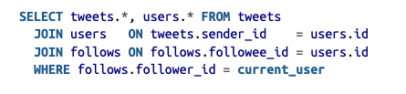
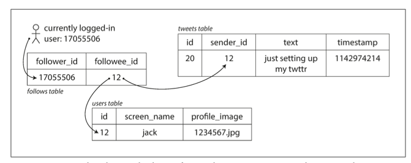
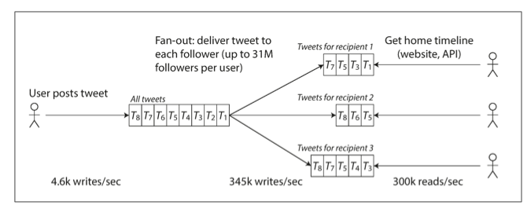

<h2> Reliable, Scalable, and Maintainable Applications </h2>

1. **Reliability** - A system should continue to perform *correctly*(performing the correct function at desired level of performance) even in the face of *adversity*(hardware or software faults, human error).

    * Hardware faults - Causes - Hard disks crash, RAM becomes faulty, the power grid has a blackout, someone unplugs the wrong network cable.

    * Simple fixes - Add redundancy to individual hardware components - 
        * Organise disks in a [RAID(Redundant Array Independent Disks)](https://www.techtarget.com/searchstorage/definition/RAID#:~:text=RAID%20(redundant%20array%20of%20independent%20disks)%20is%20a%20way%20of,case%20of%20a%20drive%20failure.) configurations - Does data mirroring(having multiple copies of data across drives) and data striping(partitioning single data along multiple drives to improve read performance) to achieve redendancy and performance.
        * Server can have dual power supplies and [hot-swappable](https://en.wikipedia.org/wiki/Hot_swapping) CPUs.
        * Data centers may be batteries and diesel generators for back power.

    * Hardware component redundancy makes total failure of single machine rare. But current data intensive systems use a large number of machines, increasing the rate of failures, hence there is move towards systems that can tolerate multiple machine failures, by using software fault tolerance techniques.

    * Software faults - examples - Bug that causes every instance of an application server to crash, a runaway process that uses up shared CPU, a service that the system depends on slows down, or becomes completely unresponsive, a software bug that introduces cascading failures.

    * No easy solutions - extensive testing under crash scenarios.

2. **Scalability** - As the system grows(in data volume, traffic volume, or complexity), there should be reasonable ways of dealing with that growth.

    * Potential load parameters(based on architecture of system) - request per second to a web server, read/write ratio in a database, number of simultaneous active users in a chat, hit rate on a cache etc.

    * Twitter case study - System requirements and load expectations - 
        1. Post tweet - A user can publish a new message to their followers(4.6k requests per second, 12k at peak).
        2. Home timeline - A user can view tweets posted by people they follow(300k request per second).

    * Twitter case study - Approaches to handle this load - 
        1. Posting tweet simply inserts tweet into a global database of tweets. Requesting home timeline can then be done using following sql like query on the tweets, users, follows tables.

    
    

        2. Since home timeline requests are 2 orders of magnitude higher than post requests, we can maintain a cache for each users timeline - like a mailbox of tweets for each recepient user. Read now becomes cheap while write becomes costlier.

    

    * In the second approach, write is heavily dependent on number of followers of a particular user. If a user has 30M followers, a single tweet will result in write to 30M caches!! Delivering the tweet to all users in a timely manner(twitter tries to deliver within 5 seconds) is a challenge.
    * In this example, **the number of followers per user** is a key load parameter when discussing scalability, since it determines fan-out load.
    * To handle users with high follower count, twitter adopted a hybrid approach of 1. and 2. Twitter stores a seperate tweets database for celebrity users with high follower count and uses approach 1. to retrieve the tweets. While it uses approach 2. for the rest of the tweets.
   
    * Describing/measuring performance - service response time - think of response time as not a single number and instead as a distribution of values.
    * p50 - median request time - half of the requests are serviced within this time
    * similarly p95, p99, p999 - why are they relevant - Amazon observed that a 100ms increase in response time reduces sales by 1%, and others report a 1-second slowdown reduces customer satisfaction metric by 16%!

3. Maintainability - Over time, many different people will work on the system(engineering and operations, both maintaining current behaviour and adapting the system to new use cases), and they should be able to work on it productively - 
    1. Operability - Make it easy for operations team to keep the system runnign smoothly
        * Good documentation, tracking dependencies, runtime behaviour monitoring etc.
    2. Simplicity - Make it easy for new engineers to understand the system, by removing as much compexity as possible
        * Good abstractions, avoiding complexity
    3. Evolvability - Make it easy for engineers to make changes to the system in the future.
        * Agile - test driven development
